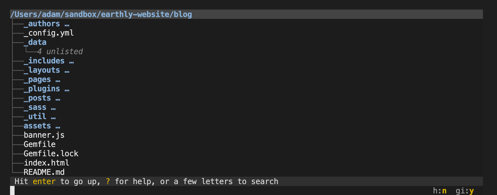

$Lastupdate: 2021/11/01 22:23:45 $ T.AIHANA

* [6 Command Line Tools for Productive Programmers](https://earthly.dev/blog/command-line-tools/) の日本語訳

----

# プログラマが生産性を上げるために役立つ６つのコマンドライン・ツール

## はじめに

最近、私はコマンドラインでいろんなことをやっています。
と言っても、私は端末を使う「筋金入り」のキーボード・ユーザではありませんが（Vim エディタよりも VSCode を使います）、`grep` や `cat` 、そして `sort` といった、まさに POSIX 標準のコマンドライン・ツールを使って実行できる複雑な作業がたくさんあることに驚いています。
コマンドライン・ツールについて、さらにたくさんのことを学習するために自分の「コマンドライン・ツール・ボックス」にはいくつか新しいツールを追加してきました。
この投稿では、私がそこで役に立ったと感じたいくつかのツールを紹介しようと思います。

----

## broot

`broot` との出会いについて詳細は覚えていませんが、とても便利なツールです。
あまり深くないディレクトリの中にいて、そこの状態を見たい時は `tree` コマンドが最適です：

```shell
$ tree
.
├── dartboard.png
├── header.jpg
├── opensign.png
├── quote1.png
└── trophy.png

0 directories, 5 files
```

ただし、もしそのディレクトリにファイルやサブディレクトリが大量にあった場合、`tree` の有用性は大幅に低下します。
すなわちファイルの一覧がスクロールしてしまうので、たくさんの情報のうち最後の画面に表示されるものしか見ることができません：

```shell
$ tree 
＜ ザーッと表示がスクロールされる＞
├── banner.js
└── index.html

328 directories, 2028 files
```

`broot` は、使っている端末のウィンドウ・サイズを認識し、その大きさに合わせて表示する出力を調整することで、このような問題を解決します。



```shell
$ T.B.D.
```

`broot` の中で矢印キーを使い表示する箇所を変更することができる他に、`-w` オプションを渡すと（`broot -w`）ディスク使用量を確認することができます。

```shell
$ T.B.D.
```

他にもたくさんのことができるので、詳しくは [GitHub guide](https://github.com/Canop/broot) をご覧ください。
自分にとっては、ちょうど良い感じ機能を持つ `tree` の代替えです。

### broot のインストールについて

MacOS にインストールする場合は次にように `brew` を使い、他のOSの場合は[公式のインストール手順](https://dystroy.org/broot/install/)に従ってください。

```shell
$ brew install broot
```

----

## Funky

普段から端末を使い、[端末を IDE の類として利用](https://blog.sanctum.geek.nz/unix-as-ide-files/)したいと考えているのであれば、現在のディレクトリを起点にして別の端末に変更していけると便利です。
これを実現する方法はいろいろあります。
[DirEnv](https://blog.sanctum.geek.nz/unix-as-ide-files/) というツールは任意のディレクトリへ移動したら `.env` なるファイルを読み込んで環境変数を適用したり無効にしたりします。
[SmartCd](https://blog.sanctum.geek.nz/unix-as-ide-files/) も同様の類のツールで、特定のディレクトリへ移動するたびに任意の Shell スクリプトを実行してくれます。
すなわち、いろいろなサービスを起動したり停止したりコマンド・プロンプトを変更したり、他にも必要なことは何でもできるというわけです。

ただし、この類のツールの中で私のお気に入りは名前が面白い [Funky](https://github.com/bbugyi200/funky#funky-) というツールです。
これは「Shell の関数を簡単に定義できて、柔軟性が高く、より対話志向にすることで Shell 関数そのものを一つ上のレベルに引き上げる」ことができます。

`Funky` の仕組みは単純です：
任意のディレクトリへ移動すると、`funky` は `.funky` ファイルを探します。
このファイルにはいろいろな bash の関数の一覧が記載されています。
それらの関数の定義を有効にし、逆に他のディレクトリへ移動する際は有効にしていた関数の定義を無効にします。

これは、例えば私が [Jekyll](http://jekyllrb-ja.github.io/) を使ってブログを書く専用のディレクトリにいる時は、新しい投稿を作成したり、Markdown の文法をチェックしたり、いろいろな画像をダウンロードするなどの（エイリアスされた独自の）コマンドを使えるということです。
`funky` と入力すると（エイリアスされた独自の）コマンドの一覧が表示されます：


```shell
$ funky
lint() { markdownlint --fix "./_posts/*.md"; }
set-header() { cp "$(latest-image)" "$(image-folder)/header.jpg"; }
set-image() { cp "$(latest-image)" "$(image-folder)/$(date +%s).png"; }
```

`funky` はこれ以外のこともいろいろできます。
関数を対話式に追加したり編集するとか、（特定のディレクトリに依存しない）グローバルな関数やコマンドのエイリアスを登録するといった機能があります。
この中で私が気に入っているのは特定のコンテキストで短いエイリアスを任意のコマンドに素早く変換することができる機能です。

### Funky のインストールについて

`pip` を使って `Funky` をインストールできます：

```shell
$ pip3 install funky
```

そのあとに、お使いの `.zshrc` や `.bashrc` あるいは同等の設定ファイルにフックを追加します：

```shell
## pip が funky.sh をインストールした場所を見つけて、それを source します
source /usr/local/lib/python3.9/site-packages/scripts/shell/funky.sh
```

----

## Fuzzy Finder (FZF)

### FIXME（画像）
「この投稿のために作成した画像ファイルの場所を `fzf` を使って特定した例」


ここまで紹介してきた `broot` と `funky` を使って私の生産性が向上していたとしたら、さらにたくさんのツールを使っても「生産性しか」向上させることができません。

そこで [Lobste.rs](https://lobste.rs/s/yfgwjr/what_interesting_command_line_tools_do) なる掲示板サイトへ行って、他にどんなツールを使っているのか質問してみました。

`FZF` なるキーワードをかなりたくさん見かけたので、そのツールを今から使ってみることにします。


[FZF](https://github.com/junegunn/fzf) とはコマンドラインの「あいまい」検索ツールです。

このツールは、コマンドラインで何か文字を入力する必要があるところで文字に似たキーワード（*fuzzy keyword*）に一致するオプションを対話式にそして高速にフィルタリングすることができます。

付属のショートカット（`/usr/local/opt/fzf/install`）をいろいろインストールしておくと、いろいろな場所で `**` キーワードと対話式のあいまい検索（インクリメンタル検索）を使って目的のパス名に絞り込んでいくことができます。

さらに `FZF` は `history` コマンドの結果を検索するのも高速です。

入力したキーワードを読み込んで対話式に絞り込んだ候補の一覧を表示し、そこから選択した文字を反対側の欄に送るといった UNIX スタイルのフィルタですが、そのように一言で紹介してしまうと、その有用性が過小評価されてしまいます。

私は、Alexey Samoshkin 氏による心地ちよいピアノを BGM として `FZF` のさまざまな使い方について説明している下記の動画をご覧になることをおすすめします。

### FIXME（動画）

### FZF のインストールについて

お使いの[パッケージ・マネージャに応じた方法で](https://github.com/junegunn/fzf#using-linux-package-managers)`FZF` をインストールして下さい：

```shell
$ brew install fzf
```

そのあとに、お使いの `.zshrc` や `.bashrc` あるいは同等の設定ファイルにフックを追加します：


```shell
## ZSH の場合
$ source ~/.fzf.zsh

## BASH の場合
$ source ~/.fzf.bash
```

----

## McFly

### FIXME（画像）
「`McFly` を使って、このパスにある "[earthly](https://earthly.dev)" というコマンドのオプションをいろいろ提示している例」

`FZF` は（`vim **` などで）ファイルをオープンする際にコマンドラインから対象となるファイル名をフィルタリングするのに最適なツールですが、コマンドラインを補完するような場合は、`.history` ファイルに記録された実際のコマンドライン列よりももっとたくさんの「オプション情報」が含まれます。
[McFly](https://github.com/cantino/mcfly/) は、これらの情報を使ってもっと関連性の高い結果を提供しようとするツールです。

でも「オプション情報」って何んでしょうか？
まず `McFly` は、次のようなヒューリスティック分析した結果に重み付けして提案するオプションを検討します：

- そのコマンドの前に入力したコマンド
- そのコマンドを実行した回数
- 最後にそのコマンドを実行した時期

これらのすべてを SQLite のデータベースを利用して追跡し、次のような条件で重み付けして提示します：

- コマンドの終了ステータス
- コマンドを実行したディレクトリ
- 以前 `McFly` で選択したことがあるかどうか

私にとって、実行に失敗したコマンドが提示されるのはちょっと不満ですが、現在いるディレクトリに応じて提示してくれる選択肢を絞り込んだり、今まで一度も使ったことがないオプションの重み（ランク）が低くなるなんてことは意外でした。

`McFly` はニューラル・ネットを使って重み付けしていきますが、ここで考えられる欠点の一つは、SQLite のデータベースが肥大化した場合に選択肢が提示されるまでに時間がかかるということです。
ただし `MCFLY_HISTORY_LIMIT` という環境変数でデータベースの肥大化を制限することができます。

使いだしてからまだ数日しか経っていないので公正な評価を下すことはできませんが、実際の使用に合わせてツールをいろいろカスタマイズするためのオプションを利用するというコンセプトは、私にかなり希望を与えてくれるものではあります。


### McFly のインストールについて

[いろいろな方法](https://github.com/cantino/mcfly/#installation)で `McFly` をインストールすることができます。
次は `brew` を使う例です：

```shell
$ brew tap cantino/mcfly
$ brew install mcfly
```

そのあとに、お使いの .zshrc や .bashrc あるいは同等の設定ファイルにフックを追加します：

```shell
$ eval "$(mcfly init zsh)"
```

私にとって、ELF が init スクリプトをホームディレクトリにダンプするのではなく、init スクリプトを出力してくれるのはいい感じです。
（次に紹介する）`zoxide` も同じようにしてくれます。


あとで `FZF` が `McFly` の `CTRL-R` キーと干渉していることがわかり、`McFly` を動かすために `FZF` の init スクリプトにある定義をコメントアウトしてやる必要がありました。

----

## Better CD


### FIXME（画像）
「`cd` の代替コマンドとして `zoxide` を使った例」

いろいろなパスを補完する際は `FZF` は便利なのですが、`cd` コマンドを使ってディレクトリを移動するときは役に立ちませんでした：
ホーム・ディレクトリから `cd ** [TAB]` と入力すると `FZF` が全候補のリストを作成するまでしばらく待たされます。
任意のディレクトリへ移動する際は、ZSH の補完機能で `cd [TAB] ディレクトリの選択 [TAB] ディレクトリの選択` とした方がはるかに高速でした。

とはいえ `cd` コマンドを改善しようとするツールがたくさん存在しています。
[autojump](https://github.com/wting/autojump) とか [z](https://github.com/rupa/z)、あるいは [Fasd](https://github.com/clvv/fasd) はすべてディレクトリの利用状況を追跡し、いつもアクセスしているディレクトリへ移動するショートカットのキーを提供くれます。
[r/commandline](https://www.reddit.com/r/commandline/comments/4v5nlt/what_cd_tool_do_you_use_if_any_autojump_j_z_etc/) には `cd` コマンドを置き換えるこれらのツールの詳細な説明が紹介されていますが、その中で最も「勢いのある」ツールが `zoxide` でした。
[zoxide](https://github.com/ajeetdsouza/zoxide) は `z` ツールを Rust で書き直したもので高速化がウリです。

インストールしたあと、今までの `cd`（あるいは `z ~/path/foo/bar`）コマンドのように利用できますが、さらに（重み付けされた）パス名に一致するかしないか（`z bar ~= cd ~/path/foo/bar` の結果）に基づいて移動先のディレクトリを選択することも可能です。
移動するディレクトリのフルパス名を指定する代わりに、パス名に含まれる（重複しない）文字列の一部を指定できるので、`zoxide` はその文字列の利用履歴を使って目的のディレクトリへ移動してくれます。

置き換えを容易にするために、`cd` コマンドを `zoxide` ツールで置き換えることを選択しました。
これは Shell を初期化するコードを追加する（`eval "$(zoxide init zsh --cmd cd)"`）ときに `--cmd` オプションを渡すと同じくらい簡単でした。

### zoxide のインストールについて

[いろいろな方法](https://github.com/ajeetdsouza/zoxide#step-1-install-zoxide)で `zoxide` をインストールすることができます。

```shell
$ brew install zoxide
```

そのあとに、お使いの .zshrc や .bashrc あるいは同等の設定ファイルにフックを追加します：

```shell
eval "$(zoxide init zsh --cmd cd)"
```

----

## GitUpdate

これも [Lobste.rs](https://lobste.rs/s/yfgwjr/what_interesting_command_line_tools_do) なる掲示板サイトのスレッドで見つけたツールです。
私は git のブランチで作業しているときには頻繁に commit していくほうです。
例えばブログの投稿で非常に大きな文の段落を削除する前とか、コードの一部をリファクタリングしようとする前には、まずそこまでの作業結果を commit しておきます。
もちろん、それらの commit はあとで squash または再構築することになりますが、面倒なので次に示す `wip`（*Working In Progress*（作業中の意味））なる git エイリアスを定義しておいて commit に手間がかからないようにしています。

```shell
git wip = !git add --all; git ci -m WIP
```

[gitupdate](https://github.com/nikitavoloboev/gitupdate) は、このようなアイディアを簡単に改善してくれます。
`gitupdate .` と入力するとファイルを commit しますが、その際に変更されたファイル名（ただし拡張子は除く）を使って、より意味のある commit メッセージを作成してくれます。
これは、commit メッセージが重要ではない場面で最適です。


### FIXME（画像）
「`GitUpdate` が commit メッセージを作成し、commit して push までしてくれる例」

### GitUpdat のインストールについて

```shell
$ git clone https://github.com/nikitavoloboev/gitupdate
$ go build
$ sudo cp gitupdate /usr/local/bin
```

----

## その他のツール

他にも便利なコマンドライン・ツールがたくさんあります。
この記事ですべてを紹介することができないくらいたくさんあります。
例えば、私は [./jq](https://stedolan.github.io/jq/) 、[mitmproxy](https://earthly.dev/blog/mitmproxy)、[Pandoc](https://pandoc.org/)、そして [PSTree](https://man7.org/linux/man-pages/man1/pstree.1.html) といったツールをよく使っています。
さらに、一般的な POSIX 系ツールを Rust ですべて書き換えてしまうものもあります。

もちろん [Earthly](https://earthly.dev/)自身もコマンドライン・ツールの一種であり、 いろいろな開発ステップをまとめるためにいつも使っています。
文章の妥当性をチェックするために使用しているツールは、もはや私の仕事の標準的な部分になっています。

貴方はどんな特別な（あまり一般的ではない）コマンドライン・ツールをお使いですか？
もしそんなツールをお使いなら、ぜひ教えて下さい。
私の Twitter アカウントと E-メールアドレスを下に記載しておきます。
貴方がどんなツールを使っているのか聞いてみたいです。


### Adam Gordon Bell 氏

Earthly についての情報を広めている。
CoRecursive のポッドキャストのホストを務める。
カニンガムの法則の物理的具現者。

[Twitter](https://twitter.com/adamgordonbell)
[E-メール](mailto:adam+website@earthly.dev)
[ホームページ](https://corecursive.com/)
